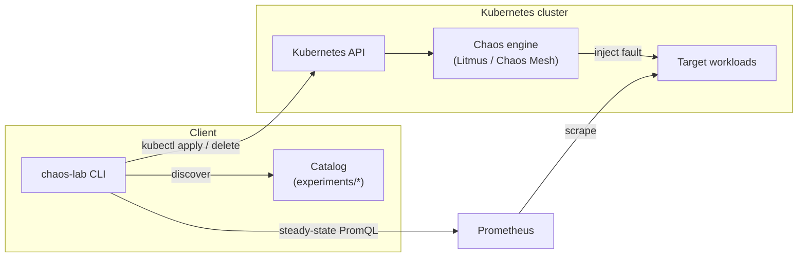

# Chaos Engineering Lab

A curated library of **LitmusChaos** and **Chaos Mesh** experiment manifests,
paired with a typed Python **experiment runner** that applies experiments,
monitors steady-state hypotheses against Prometheus, and reports structured
results.

[](LICENSE)
[](https://github.com/abhisheksawant52/chaos-engineering-lab/actions/workflows/ci.yml)
[](https://www.python.org/)
[](https://github.com/psf/black)

## Overview

Chaos engineering is the discipline of injecting controlled failure into a
system to build confidence in its resilience. This lab bundles two things a
team needs to do that well:

1. A **catalog of ready-to-run experiments** for the two most common Kubernetes
   chaos platforms — LitmusChaos and Chaos Mesh — covering pod, node, network,
   CPU, and I/O faults.
2. A **runner** (`chaos-lab`) that turns an experiment into an actual
   hypothesis-driven test: it verifies the system is healthy before injecting a
   fault, applies the manifest, waits, tears it down, and confirms the system
   recovered — all measured against Prometheus.

It is intended for platform and SRE teams running game days in non-production
environments before graduating experiments to production.

## Architecture



Components:

- **CLI** (`chaos_lab.cli`) — `list`, `validate`, `run` subcommands.
- **Catalog** (`chaos_lab.catalog`) — loads manifests + annotations into models.
- **Runner** (`chaos_lab.runner`) — orchestrates the experiment lifecycle.
- **Steady state** (`chaos_lab.steady_state`) — Prometheus-backed hypotheses.
- **Manifests** (`experiments/`) — Litmus and Chaos Mesh experiment definitions.

## Features

- Real, valid experiment manifests for **LitmusChaos** (pod-delete, node-cpu-hog,
  network-latency) and **Chaos Mesh** (pod-kill, network-delay, stress-cpu,
  io-fault).
- **Steady-state hypotheses** declared inline in each manifest and evaluated
  against Prometheus before and after the fault.
- Automatic **abort** if the system is not healthy before an experiment starts.
- Blast-radius controls (mode, percentage, duration, selectors) baked into
  every manifest.
- `--dry-run` mode to preview an experiment without touching the cluster.
- Kubernetes **RBAC** and a scheduled **CronJob** runner.
- **Terraform** module to install the chaos platform via Helm.

## Tech Stack

- **Python 3.11+**, [Click](https://click.palletsprojects.com/),
  [Pydantic](https://docs.pydantic.dev/) / pydantic-settings.
- [kubernetes](https://github.com/kubernetes-client/python) client + `kubectl`.
- [LitmusChaos](https://litmuschaos.io/) and
  [Chaos Mesh](https://chaos-mesh.org/).
- [Prometheus](https://prometheus.io/) for steady-state metrics.
- Terraform (helm + kubernetes providers), Docker, GitHub Actions.

## Getting Started

### Prerequisites

- Python 3.11 or 3.12
- Access to a Kubernetes cluster (`kubectl` configured)
- A chaos platform installed on the cluster (see [Deployment](#deployment))
- Prometheus reachable from where you run `chaos-lab`

### Install

```bash
python -m pip install --upgrade pip
pip install -e ".[dev]"
cp .env.example .env   # then edit for your environment
```

### Usage

```bash
# List all discovered experiments and their hypotheses
chaos-lab list

# Validate that every manifest parses
chaos-lab validate

# Preview without applying (evaluates steady state only)
chaos-lab run pod-delete --dry-run

# Run an experiment end to end
chaos-lab run pod-kill --engine chaos-mesh
```

You can also apply manifests directly with `kubectl`:

```bash
kubectl apply -n chaos-testing -f experiments/chaos-mesh/pod-kill.yaml
```

See [`docs/runbook.md`](docs/runbook.md) for how to run experiments safely.

## Experiment Catalog

| Engine     | Experiment        | Fault                         | Duration | Hypothesis                          |
| ---------- | ----------------- | ----------------------------- | -------- | ----------------------------------- |
| Litmus     | `pod-delete`      | Delete pods                   | 60s      | availability ≥ 0.99, replicas ≥ 2   |
| Litmus     | `node-cpu-hog`    | Saturate node CPU             | 120s     | p99 latency < 0.5s                  |
| Litmus     | `network-latency` | Inject egress latency         | 90s      | 5xx error rate < 5%                 |
| Chaos Mesh | `pod-kill`        | Kill a pod                    | 30s      | availability ≥ 0.99, replicas ≥ 2   |
| Chaos Mesh | `network-delay`   | Add 300ms egress latency      | 90s      | 5xx error rate < 5%                 |
| Chaos Mesh | `stress-cpu`      | Burn CPU in pods              | 120s     | p99 latency < 0.5s                  |
| Chaos Mesh | `io-fault`        | Inject disk I/O latency       | 60s      | 2xx success rate ≥ 95%              |

Full details in [`docs/experiments.md`](docs/experiments.md).

## Project Structure

```text
chaos-engineering-lab/
├── src/chaos_lab/           # Python package
│   ├── cli.py               # chaos-lab CLI (list / validate / run)
│   ├── catalog.py           # manifest discovery -> Experiment models
│   ├── runner.py            # experiment lifecycle orchestration
│   ├── steady_state.py      # Prometheus hypothesis evaluation
│   ├── models.py            # Experiment / SteadyStateHypothesis / Result
│   ├── config.py            # pydantic-settings configuration
│   └── logging_config.py    # structured logging
├── experiments/
│   ├── litmus/              # LitmusChaos manifests
│   └── chaos-mesh/          # Chaos Mesh manifests
├── kubernetes/              # ServiceAccount, Role, RoleBinding, CronJob
├── terraform/               # Helm install of the chaos platform
│   ├── modules/chaos-platform/
│   └── environments/{dev,prod}/
├── docs/                    # runbook, catalog, architecture
├── tests/                   # pytest suite
├── Dockerfile
└── pyproject.toml
```

## Configuration

Configuration is read from environment variables (or a `.env` file). See
[`.env.example`](.env.example).

| Variable          | Description                                   | Default                   |
| ----------------- | --------------------------------------------- | ------------------------- |
| `KUBECONFIG`      | Path to the kubeconfig for the cluster        | `~/.kube/config`          |
| `NAMESPACE`       | Namespace experiments are applied to          | `chaos-testing`           |
| `CHAOS_ENGINE`    | `litmus` or `chaos-mesh`                       | `chaos-mesh`              |
| `PROMETHEUS_URL`  | Base URL of Prometheus for steady-state checks | `http://prometheus:9090` |
| `EXPERIMENTS_DIR` | Directory holding experiment manifests         | `experiments`            |
| `LOG_LEVEL`       | Log level (DEBUG/INFO/WARNING/ERROR)          | `INFO`                    |

## Deployment

### Install the chaos platform with Terraform

```bash
cd terraform
terraform init
terraform apply -var-file=environments/dev/terraform.tfvars
```

The module (`terraform/modules/chaos-platform`) creates the `chaos-testing`
namespace and installs **Chaos Mesh** or **LitmusChaos** via a Helm release.

### Apply RBAC and the scheduled runner

```bash
kubectl apply -f kubernetes/serviceaccount.yaml
kubectl apply -f kubernetes/role.yaml
kubectl apply -f kubernetes/rolebinding.yaml
kubectl apply -f kubernetes/deployment.yaml   # scheduled CronJob runner
```

### Container image

```bash
docker build -t ghcr.io/abhisheksawant52/chaos-engineering-lab:0.1.0 .
docker run --rm ghcr.io/abhisheksawant52/chaos-engineering-lab:0.1.0 list
```

## Contributing

Contributions are welcome. Please read [CONTRIBUTING.md](CONTRIBUTING.md) and our
[Code of Conduct](CODE_OF_CONDUCT.md) before opening a pull request.

## Security

Please report vulnerabilities as described in [SECURITY.md](SECURITY.md).

## License

Released under the [MIT License](LICENSE).
