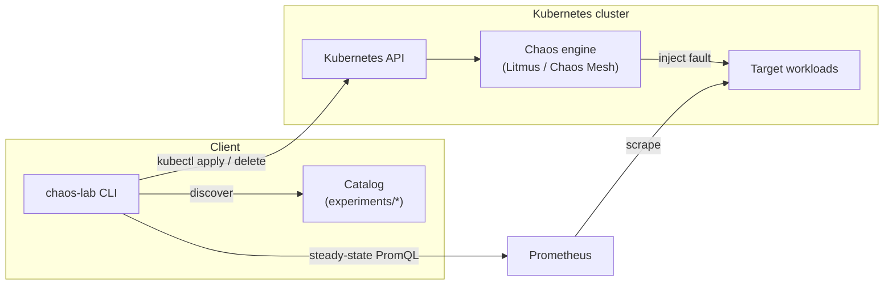

# Architecture

The chaos lab pairs a catalog of experiment manifests with a Python runner that
orchestrates the experiment lifecycle and validates steady-state hypotheses.

## Components

- **CLI (`chaos_lab.cli`)** — `list`, `validate`, and `run` subcommands.
- **Catalog (`chaos_lab.catalog`)** — discovers manifests and reads their
  `chaos-lab.dev/*` annotations into typed `Experiment` objects.
- **Runner (`chaos_lab.runner`)** — evaluates steady state, applies the manifest
  via `kubectl`, waits for the configured duration, tears down, and re-checks.
- **Steady state (`chaos_lab.steady_state`)** — queries Prometheus and compares
  the result to each hypothesis threshold.
- **Chaos engine** — LitmusChaos or Chaos Mesh, installed via the Terraform
  module in `terraform/modules/chaos-platform`.

## Experiment lifecycle

1. Evaluate steady-state hypotheses (abort if they do not hold).
2. Apply the experiment manifest to the cluster.
3. Let the fault run for the experiment's duration.
4. Tear the experiment down.
5. Re-evaluate steady state to confirm recovery and produce an `ExperimentResult`.
